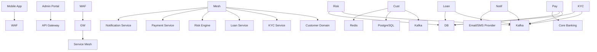
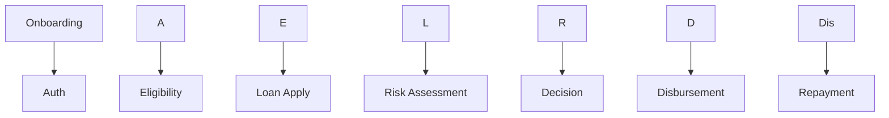
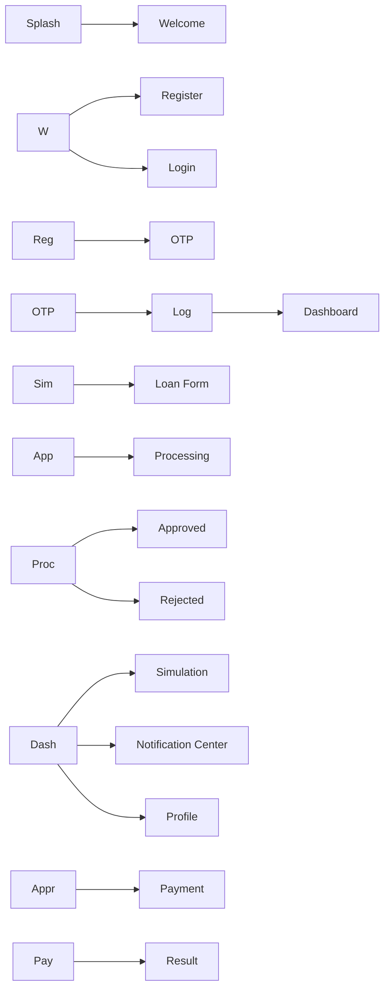
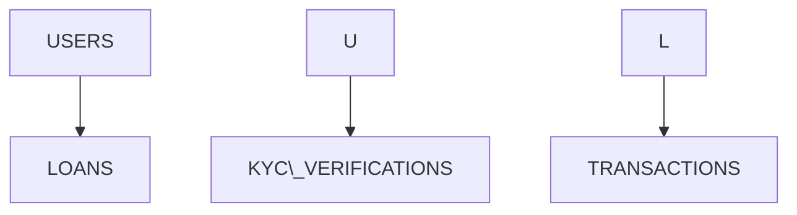
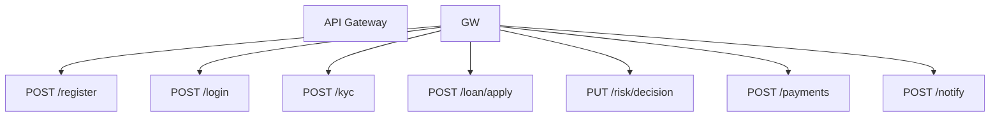
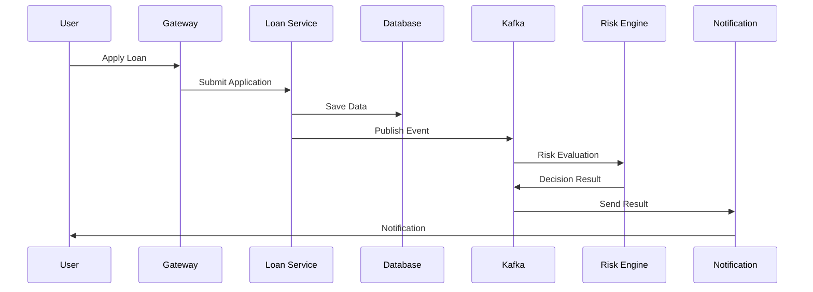
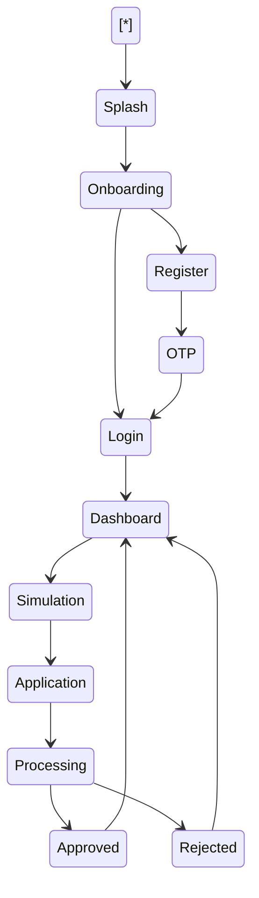
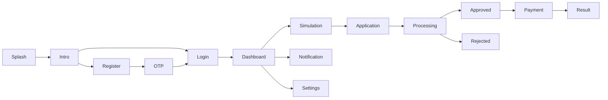
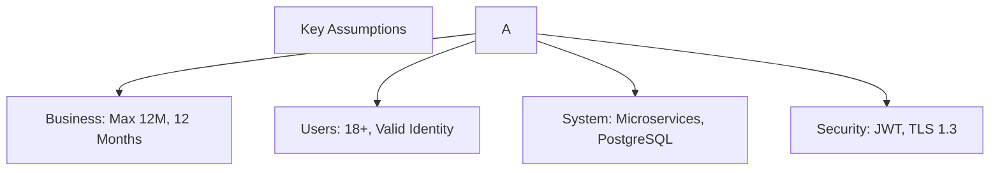

# PT XYZ FinTech - Mobile Lending Application

## Solution Analyst Assessment

> \*\*Tech Stack\*\*: Enterprise Microservices, Cloud Native, Event-Driven
> (Kafka), PostgreSQL, Kubernetes.

\---
Author

**Miftahul Arifin**  
Business Analyst | System Analyst | Solution Analyst  
miftahularifin.id@gmail.com

\---

# ✅ Mapping Terhadap Soal Technical Test

\---

Soal Technical Test     Visual Assets            Alternatif Kode Mermaid

\---

**1. High Level Design  `01\_High\_Level\_Design\_Architecture.png`   Lihat Bagian 1
Architecture**

**2. Screen Flow \&      `03\_Screen\_Flow.png`, `04\_ERD.png`        Lihat Bagian 3 \& 4
ERD**

**3. Detail Design      `05\_API\_Design.png`,                      Lihat Bagian 5 \& 6
API**                   `06\_Sequence\_Diagram.png`

**4. Detail Screen      `07\_State\_Machine.png`,                   Lihat Bagian 7 \& 8
Behavior**              `08\_Wireframe\_Design.png`

**Tambahan**            `09\_Traceability\_Matrix.png`,             Lihat Bagian 9-11
`10\_Assumptions.png`, `11\_NFR.png`
---

\---

# 1\. HIGH LEVEL DESIGN ARCHITECTURE

!\[High Level](02\_Architecture\_Design/assets/01\_High\_Level\_Design\_Architecture.png)

\---

# 2\. BUSINESS PROCESS FLOW

!\[Business Process](01\_Project\_Overview/assets/02\_Business\_Process\_Flow.png)

\---

# 3\. SCREEN FLOW

!\[Screen Flow](03\_Screen\_Behavior\_UI\_UX/assets/03\_Screen\_Flow.png)

\---

# 4\. ERD - DATABASE DESIGN

!\[ERD](02\_Architecture\_Design/assets/04\_ERD.png)

\---

# 5\. API DESIGN

!\[API Design](02\_Architecture\_Design/assets/05\_API\_Design.png)

\---

# 6\. SEQUENCE DIAGRAM

!\[Sequence Diagram](04\_Sequence\_Diagrams/assets/06\_Sequence\_Diagram.png)

\---

# 7\. STATE MACHINE

!\[State Machine](03\_Screen\_Behavior\_UI\_UX/assets/07\_State\_Machine.png)

\---

# 8\. LOW \& HIGH DESIGN

!\[Wireframe](03\_Screen\_Behavior\_UI\_UX/assets/08\_Wireframe\_Design.png)

\---

# 9\. TRACEABILITY MATRIX

!\[Traceability](01\_Project\_Overview/assets/09\_Traceability\_Matrix.png)

BR-ID   Requirement   Endpoint             Screen

\---

BR-01   Register      POST /register       Screen 03
BR-02   Login         POST /login          Screen 05
BR-03   KYC           POST /kyc            Screen 08
BR-04   Apply Loan    POST /loan/apply     Screen 13
BR-05   Decision      PUT /risk/decision   Screen 15/16

\---

# 10\. ASSUMPTIONS

!\[Assumptions](01\_Project\_Overview/assets/10\_Assumptions.png)

\---

# 11\. NON-FUNCTIONAL REQUIREMENTS

!\[NFR](02\_Architecture\_Design/assets/11\_NFR.png)

* Availability: 99.9%
* Performance: < 2 Seconds Response
* Scalability: Kubernetes Horizontal Scaling
* Security: OAuth2, JWT, WAF
* Compliance: ISO 27001, OJK

\---

# 

