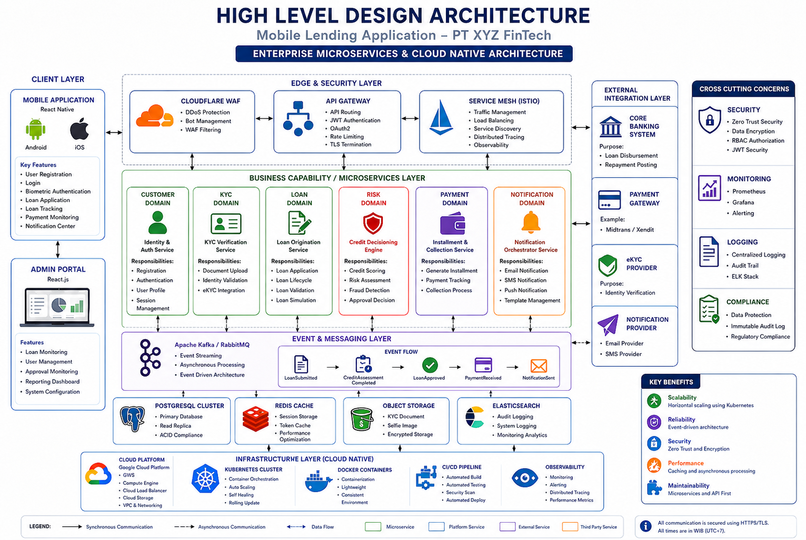

# PT XYZ FinTech - Mobile Lending Application (Solution Analyst Assessment)
> **Tech Stack**: Enterprise Microservices, Cloud Native, Event-Driven (Kafka), PostgreSQL, Kubernetes.

---

## 📂 1. HIGH LEVEL DESIGN ARCHITECTURE


**Mermaid Equivalent (Sesuai Layout):**
```mermaid
graph TD
    subgraph Client_Layer
        Mobile[Mobile App - React Native] --> WAF[Cloudflare WAF]
        Admin[Admin Portal - React.js] --> GW[API Gateway]
    end
    WAF --> GW
    GW --> Mesh[Service Mesh - Istio]
    
    Mesh --> CustSvc[Customer Domain Service]
    Mesh --> KYCSvc[KYC Verification Service]
    Mesh --> LoanSvc[Loan Origination Service]
    Mesh --> RiskSvc[Risk Decision Engine]
    Mesh --> PaySvc[Payment & Collection Service]
    Mesh --> NotifSvc[Notification Service]

    subgraph Event_Layer
        Kafka[Apache Kafka / RabbitMQ]
    end
    CustSvc & KYCSvc & LoanSvc & RiskSvc & PaySvc & NotifSvc --> Kafka
    
    subgraph Data_Layer
        DB[PostgreSQL Cluster]
        Cache[Redis Cache]
        Storage[Object Storage - MinIO]
        ES[ElasticSearch]
    end
    CustSvc & KYCSvc & LoanSvc & RiskSvc & PaySvc & NotifSvc --> DB
    CustSvc & KYCSvc --> Cache
    KYCSvc & NotifSvc --> Storage
    PaySvc --> ES

    subgraph External_Integration
        CoreBank[Core Banking System]
        PayGateway[Payment Gateway - Midtrans/Xendit]
        KYCProvider[KYC Provider - eKYC]
        NotifProvider[Email / SMS Provider]
    end
    PaySvc --> CoreBank
    PaySvc --> PayGateway
    KYCSvc --> KYCProvider
    NotifSvc --> NotifProvider