# PT XYZ FinTech — Mobile Lending Application
## Solution Analyst Technical Test Submission

> **Tech Stack:** Enterprise Microservices, Cloud Native, Event-Driven (Kafka), PostgreSQL, Kubernetes

**Disusun oleh:** Miftahul Arifin
**Role:** Business Analyst | System Analyst | Solution Analyst
**Email:** miftahularifin.id@gmail.com

---

## Ringkasan Eksekutif

PT XYZ adalah perusahaan fintech yang ingin mengembangkan aplikasi **pinjaman online (mobile lending)** untuk menjangkau pengguna yang lebih luas. Dokumen ini berisi rancangan solusi end-to-end, mulai dari arsitektur sistem, alur layar, struktur data, desain API, hingga perilaku screen yang disusun untuk menjawab seluruh poin pada *Technical Test Solution Analyst*.

**Batasan bisnis utama yang menjadi dasar rancangan:**
- Registrasi memerlukan data diri, email, nomor telepon, serta upload foto & KTP (proses KYC)
- Login dapat menggunakan password atau biometric (jika tersedia di perangkat)
- User dapat melihat sisa hutang dan tagihan bulanan
- Limit pinjaman maksimal **Rp 12.000.000** dengan tenor maksimal **12 bulan**
- Hasil pengajuan: **Disetujui** atau **Ditolak**, dengan notifikasi via email & SMS jika disetujui
- **1 user hanya dapat memiliki 1 pinjaman aktif** — pengajuan baru diblokir selama pinjaman sebelumnya belum lunas

---

## Struktur Dokumen

---

## ✅ Mapping Jawaban Terhadap Soal Technical Test

| No. | Soal Technical Test | Dijawab di Bagian | File Terkait |
|---|---|---|---|
| 1 | High Level Design Architecture | Bagian 1 | `High_Level_Design_Architecture.png` |
| 2 | Screen Flow & ERD | Bagian 3, 4, 5 | `Screen_Flow_2.png`, `ERD_Database_Design.png` |
| 3 | Detail Design API (UML/ERD/Flowchart) | Bagian 6, 7 | `Sequence_Diagram.png` |
| 4 | Detail Design Screen Behavior | Bagian 8, 9, 10 | `State_Machine.png`, `Low_Design_Key_Screens.png`, `High_Design_Key_Screens.png` |
| — | Dokumen Pendukung Tambahan | Bagian 2, 11, 12, 13 | `Business_Process_Flow.png`, `Traceability_Matrix.png`, `Assumptions.png`, `Non_Functional_Requirements.png` |

---

## 1. High Level Design Architecture
*(Menjawab Soal Test #1)*

Arsitektur dirancang menggunakan pendekatan **microservices** dengan komunikasi asynchronous melalui Kafka untuk proses yang membutuhkan decoupling (risk evaluation, notifikasi), serta synchronous melalui API Gateway untuk transaksi real-time.

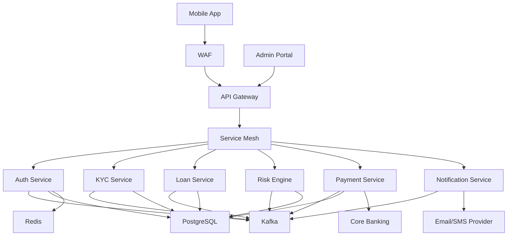
```mermaid
graph TD
Mobile["Mobile App"] --> WAF["WAF"]
Admin["Admin Portal"] --> GW["API Gateway"]
WAF --> GW
GW --> Mesh["Service Mesh"]
Mesh --> Auth["Auth Service"]
Mesh --> KYC["KYC Service"]
Mesh --> Loan["Loan Service"]
Mesh --> Risk["Risk Engine"]
Mesh --> Pay["Payment Service"]
Mesh --> Notif["Notification Service"]
Auth --> Kafka["Kafka"]
KYC --> Kafka
Loan --> Kafka
Risk --> Kafka
Pay --> Kafka
Notif --> Kafka
Auth --> DB["PostgreSQL"]
KYC --> DB
Loan --> DB
Risk --> DB
Pay --> DB
Auth --> Cache["Redis"]
Pay --> Core["Core Banking"]
Notif --> Email["Email/SMS Provider"]
```

---

## 2. Business Process Flow
*(Konteks pendukung untuk Soal Test #1)*

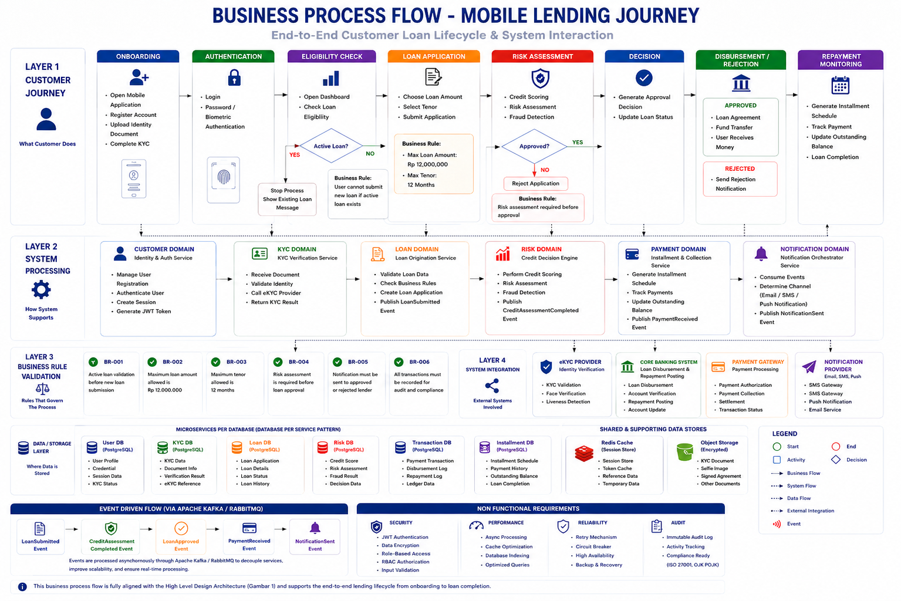

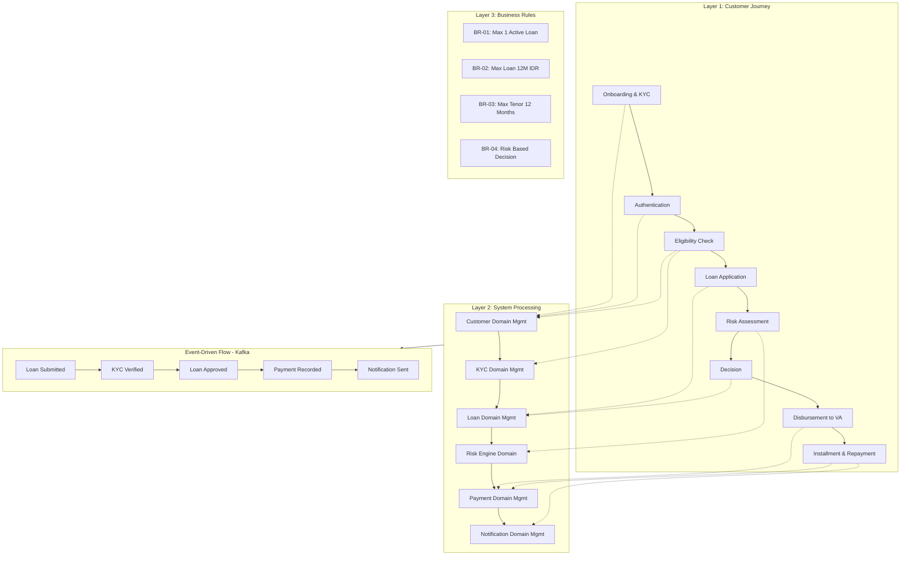
```mermaid
graph TD
    subgraph Layer1["Layer 1: Customer Journey"]
        C1[Onboarding & KYC] --> C2[Authentication]
        C2 --> C3[Eligibility Check]
        C3 --> C4[Loan Application]
        C4 --> C5[Risk Assessment]
        C5 --> C6[Decision]
        C6 --> C7[Disbursement to VA]
        C7 --> C8[Installment & Repayment]
    end

    subgraph Layer2["Layer 2: System Processing"]
        S1[Customer Domain Mgmt] --> S2[KYC Domain Mgmt]
        S2 --> S3[Loan Domain Mgmt]
        S3 --> S4[Risk Engine Domain]
        S4 --> S5[Payment Domain Mgmt]
        S5 --> S6[Notification Domain Mgmt]
    end

    subgraph Layer3["Layer 3: Business Rules"]
        R1[BR-01: Max 1 Active Loan]
        R2[BR-02: Max Loan 12M IDR]
        R3[BR-03: Max Tenor 12 Months]
        R4[BR-04: Risk Based Decision]
    end

    C1 -.-> S1
    C2 -.-> S1
    C3 -.-> S1
    C3 -.-> S2
    C4 -.-> S3
    C5 -.-> S4
    C6 -.-> S3
    C7 -.-> S5
    C8 -.-> S5
    C8 -.-> S6

    subgraph EventFlow["Event-Driven Flow - Kafka"]
        E1[Loan Submitted] --> E2[KYC Verified] --> E3[Loan Approved] --> E4[Payment Recorded] --> E5[Notification Sent]
    end

    Layer2 --> EventFlow
```

---

## 3. Screen Flow — Bagian 1: Onboarding & Autentikasi
*(Menjawab Soal Test #2)*

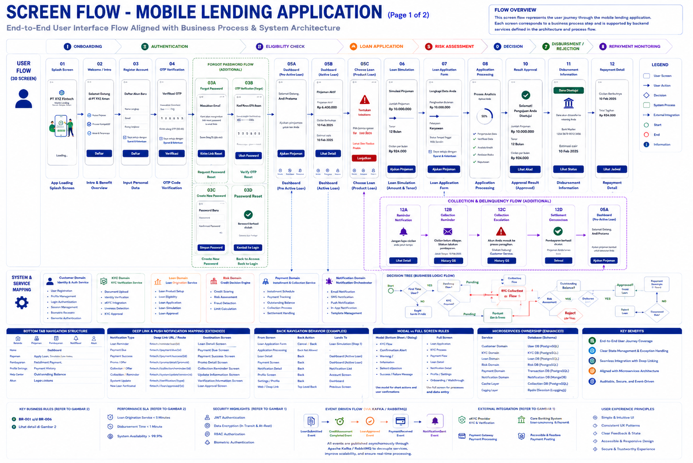

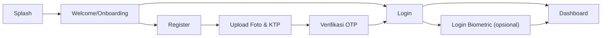
```mermaid
graph LR
S["Splash"] --> W["Welcome/Onboarding"]
W --> Reg["Register"]
W --> Log["Login"]
Reg --> KTP["Upload Foto & KTP"]
KTP --> OTP["Verifikasi OTP"]
OTP --> Log
Log --> Bio["Login Biometric (opsional)"]
Log --> Dash["Dashboard"]
Bio --> Dash
```

---

## 4. Screen Flow — Bagian 2: Pengajuan & Proses Pinjaman
*(Menjawab Soal Test #2)*

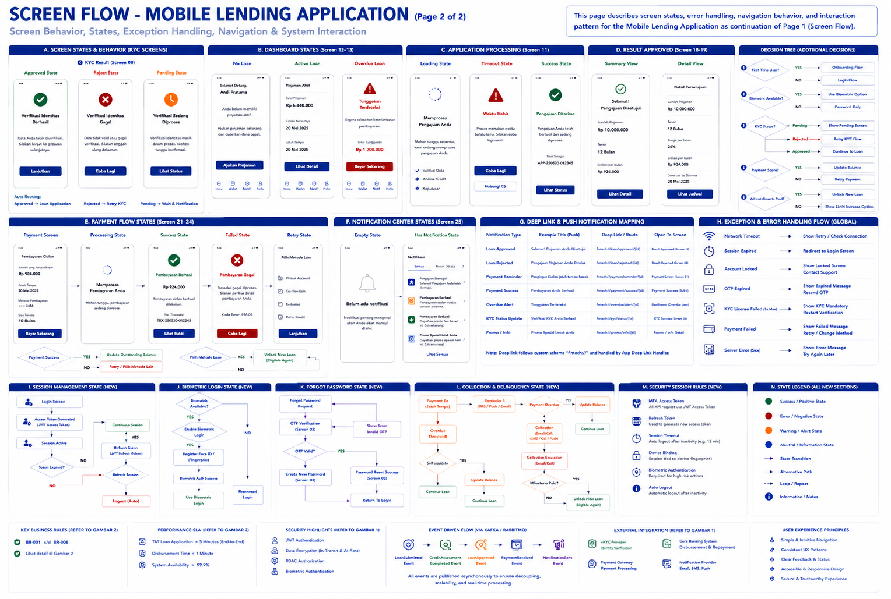

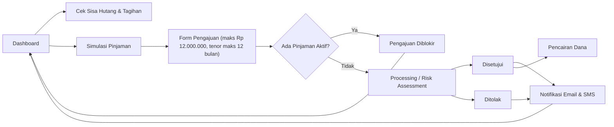
```mermaid
graph LR
Dash["Dashboard"] --> Debt["Cek Sisa Hutang & Tagihan"]
Dash --> Sim["Simulasi Pinjaman"]
Sim --> Form["Form Pengajuan (maks Rp 12.000.000, tenor maks 12 bulan)"]
Form --> Elig{"Ada Pinjaman Aktif?"}
Elig -->|Ya| Block["Pengajuan Diblokir"]
Elig -->|Tidak| Proc["Processing / Risk Assessment"]
Proc --> Appr["Disetujui"]
Proc --> Rej["Ditolak"]
Appr --> Notif["Notifikasi Email & SMS"]
Rej --> Notif
Appr --> Disb["Pencairan Dana"]
Block --> Dash
Notif --> Dash
```

---

## 5. ERD — Database Design
*(Menjawab Soal Test #2)*

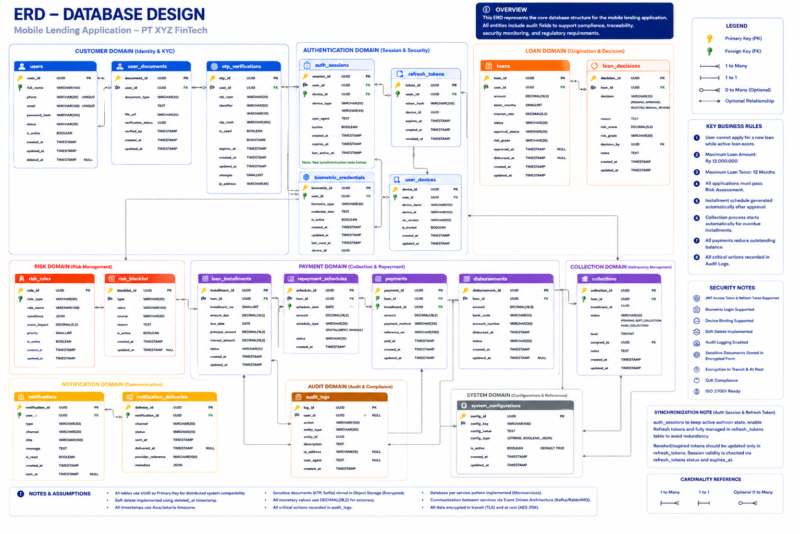

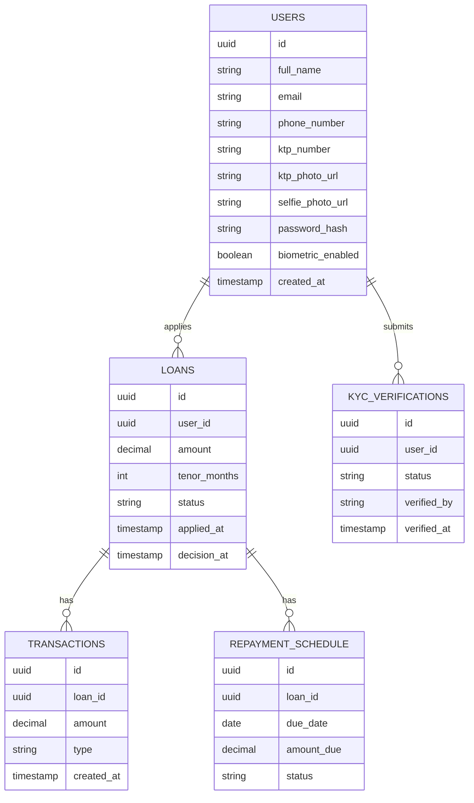
```mermaid
erDiagram
USERS ||--o{ LOANS : applies
USERS ||--o{ KYC_VERIFICATIONS : submits
LOANS ||--o{ TRANSACTIONS : has
LOANS ||--o{ REPAYMENT_SCHEDULE : has

USERS {
  uuid id
  string full_name
  string email
  string phone_number
  string ktp_number
  string ktp_photo_url
  string selfie_photo_url
  string password_hash
  boolean biometric_enabled
  timestamp created_at
}
KYC_VERIFICATIONS {
  uuid id
  uuid user_id
  string status
  string verified_by
  timestamp verified_at
}
LOANS {
  uuid id
  uuid user_id
  decimal amount
  int tenor_months
  string status
  timestamp applied_at
  timestamp decision_at
}
TRANSACTIONS {
  uuid id
  uuid loan_id
  decimal amount
  string type
  timestamp created_at
}
REPAYMENT_SCHEDULE {
  uuid id
  uuid loan_id
  date due_date
  decimal amount_due
  string status
}
```

---

## 6. API Design & Endpoint Architecture
*(Menjawab Soal Test #3)*

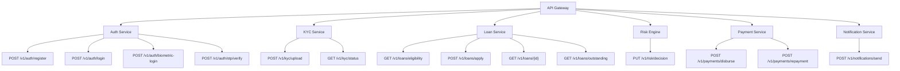
```mermaid
graph TD
GW["API Gateway"]
GW --> Auth["Auth Service"]
GW --> KYCS["KYC Service"]
GW --> LoanS["Loan Service"]
GW --> RiskS["Risk Engine"]
GW --> PayS["Payment Service"]
GW --> NotifS["Notification Service"]

Auth --> A1["POST /v1/auth/register"]
Auth --> A2["POST /v1/auth/login"]
Auth --> A3["POST /v1/auth/biometric-login"]
Auth --> A4["POST /v1/auth/otp/verify"]

KYCS --> K1["POST /v1/kyc/upload"]
KYCS --> K2["GET /v1/kyc/status"]

LoanS --> L1["GET /v1/loans/eligibility"]
LoanS --> L2["POST /v1/loans/apply"]
LoanS --> L3["GET /v1/loans/{id}"]
LoanS --> L4["GET /v1/loans/outstanding"]

RiskS --> R1["PUT /v1/risk/decision"]

PayS --> P1["POST /v1/payments/disburse"]
PayS --> P2["POST /v1/payments/repayment"]

NotifS --> N1["POST /v1/notifications/send"]
```

---

## 7. Sequence Diagram
*(Menjawab Soal Test #3)*

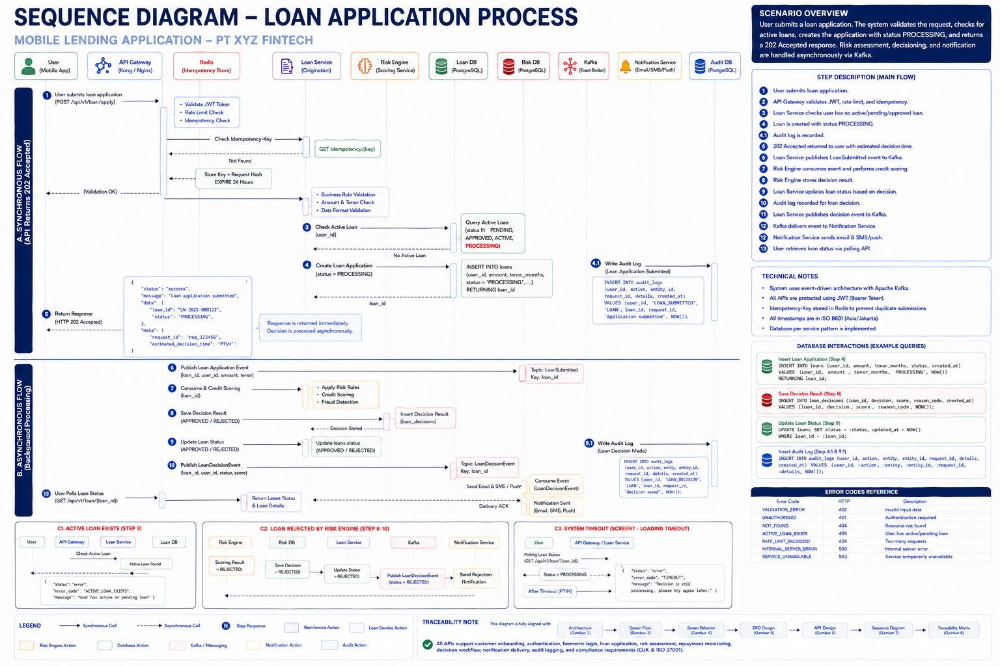

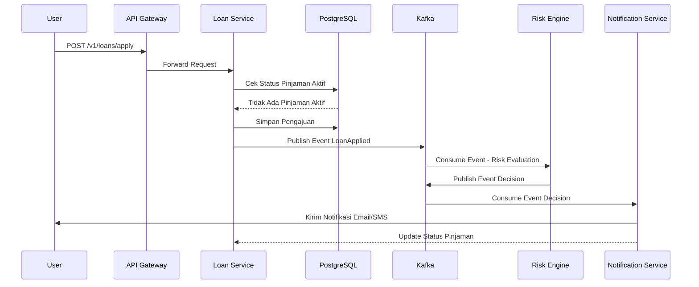
```mermaid
sequenceDiagram
participant U as User
participant GW as API Gateway
participant LS as Loan Service
participant DB as PostgreSQL
participant MQ as Kafka
participant RE as Risk Engine
participant NS as Notification Service

U->>GW: POST /v1/loans/apply
GW->>LS: Forward Request
LS->>DB: Cek Status Pinjaman Aktif
DB-->>LS: Tidak Ada Pinjaman Aktif
LS->>DB: Simpan Pengajuan
LS->>MQ: Publish Event LoanApplied
MQ->>RE: Consume Event - Risk Evaluation
RE->>MQ: Publish Event Decision
MQ->>NS: Consume Event Decision
NS->>U: Kirim Notifikasi Email/SMS
NS-->>LS: Update Status Pinjaman
```

---

## 8. State Machine — Screen Behavior
*(Menjawab Soal Test #4)*

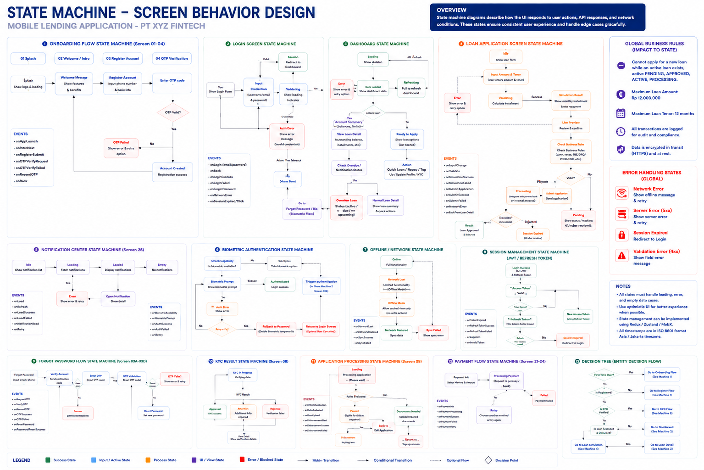

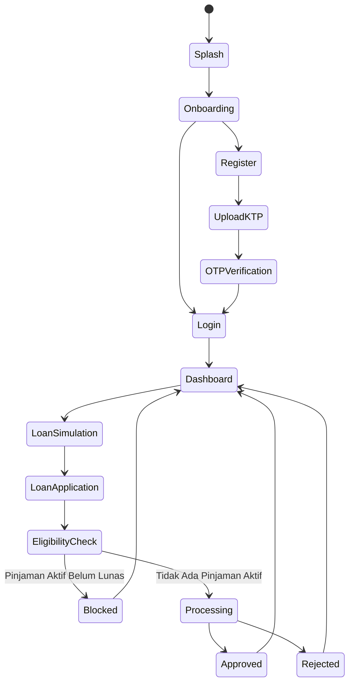
```mermaid
stateDiagram-v2
[*] --> Splash
Splash --> Onboarding
Onboarding --> Register
Onboarding --> Login
Register --> UploadKTP
UploadKTP --> OTPVerification
OTPVerification --> Login
Login --> Dashboard
Dashboard --> LoanSimulation
LoanSimulation --> LoanApplication
LoanApplication --> EligibilityCheck
EligibilityCheck --> Blocked: Pinjaman Aktif Belum Lunas
EligibilityCheck --> Processing: Tidak Ada Pinjaman Aktif
Processing --> Approved
Processing --> Rejected
Approved --> Dashboard
Rejected --> Dashboard
Blocked --> Dashboard
```

---

## 9. Low Fidelity Design (Wireframe)
*(Menjawab Soal Test #4)*

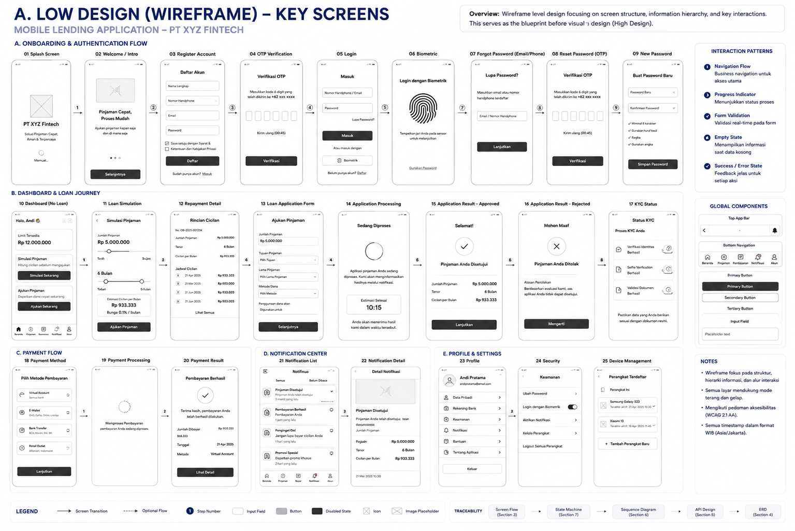

Wireframe ini menggambarkan struktur layout dasar dan urutan navigasi antar layar kunci, sebagai acuan sebelum proses styling/UI final.

---

## 10. High Fidelity Design (UI Mockup)
*(Menjawab Soal Test #4)*

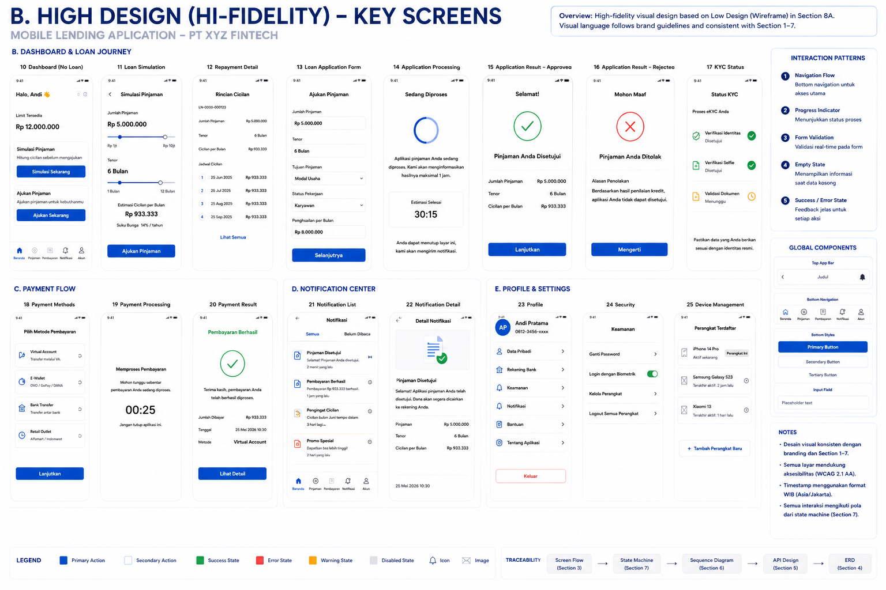

Versi high-fidelity merupakan penyempurnaan dari wireframe pada Bagian 9, lengkap dengan styling, warna, dan komponen UI final yang merepresentasikan tampilan akhir aplikasi.

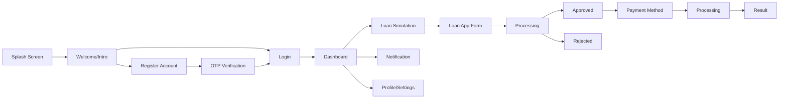
```mermaid
flowchart LR
    S1[Splash Screen] --> S2[Welcome/Intro]
    S2 --> S3[Register Account] & S4[Login]
    S3 --> S5[OTP Verification] --> S4
    S4 --> S6[Dashboard]
    S6 --> S7[Loan Simulation] --> S8[Loan App Form]
    S8 --> S9[Processing]
    S9 --> S10[Approved] & S11[Rejected]
    S10 --> S12[Payment Method] --> S13[Processing] --> S14[Result]
    S6 --> S15[Notification] & S16[Profile/Settings]
```

---

## 11. Traceability Matrix
*(Dokumen Pendukung)*

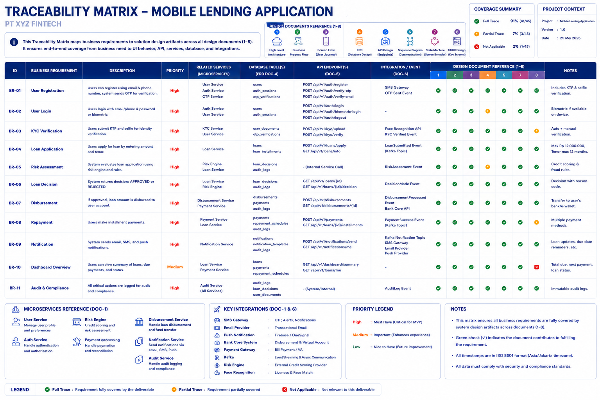

| BR-ID | Requirement (User Story) | Endpoint | Screen/Diagram |
|---|---|---|---|
| BR-01 | Registrasi: data diri, email, no. telepon, upload foto & KTP | `POST /v1/auth/register`, `POST /v1/kyc/upload` | Register, Upload KTP |
| BR-02 | Login dengan password atau biometric | `POST /v1/auth/login`, `POST /v1/auth/biometric-login` | Login |
| BR-03 | Lihat sisa hutang & tagihan bulanan | `GET /v1/loans/outstanding` | Dashboard |
| BR-04 | Pengajuan pinjaman maks Rp 12.000.000, tenor maks 12 bulan | `POST /v1/loans/apply` | Loan Application Form |
| BR-05 | Proses pengajuan → Disetujui/Ditolak | `PUT /v1/risk/decision` | Processing Screen |
| BR-06 | Notifikasi email & SMS jika disetujui | `POST /v1/notifications/send` | Notification Center |
| BR-07 | Tidak dapat mengajukan pinjaman baru jika ada pinjaman aktif | `GET /v1/loans/eligibility` | Eligibility Check (Blocked State) |

---

## 12. Assumptions
*(Dokumen Pendukung)*

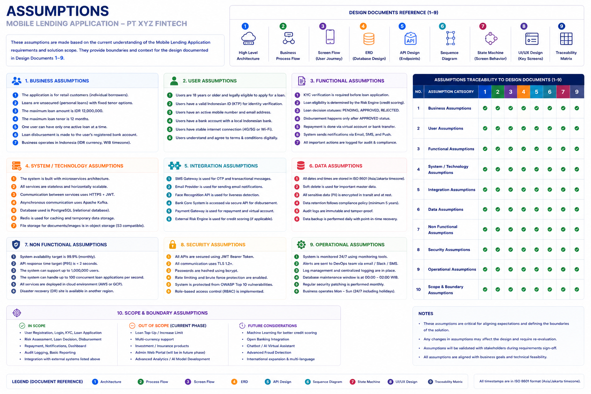

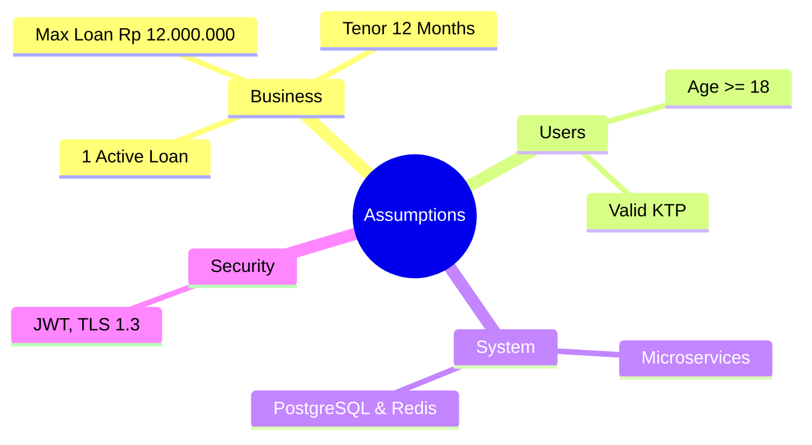
```mermaid
mindmap
  root((Assumptions))
    Business
      Max Loan Rp 12.000.000
      Tenor 12 Months
      1 Active Loan
    Users
      Age >= 18
      Valid KTP
    System
      Microservices
      PostgreSQL & Redis
    Security
      JWT, TLS 1.3
```

---

## 13. Non-Functional Requirements (NFR)
*(Dokumen Pendukung)*

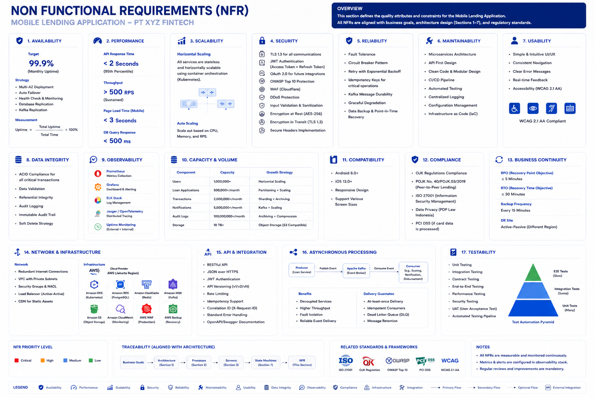

| Aspek | Target |
|---|---|
| Availability | 99.9% |
| Performance | < 2 Seconds Response Time |
| Scalability | Kubernetes Horizontal Pod Autoscaling |
| Security | OAuth2, JWT, WAF, TLS 1.3 |
| Compliance | ISO 27001, Regulasi OJK |